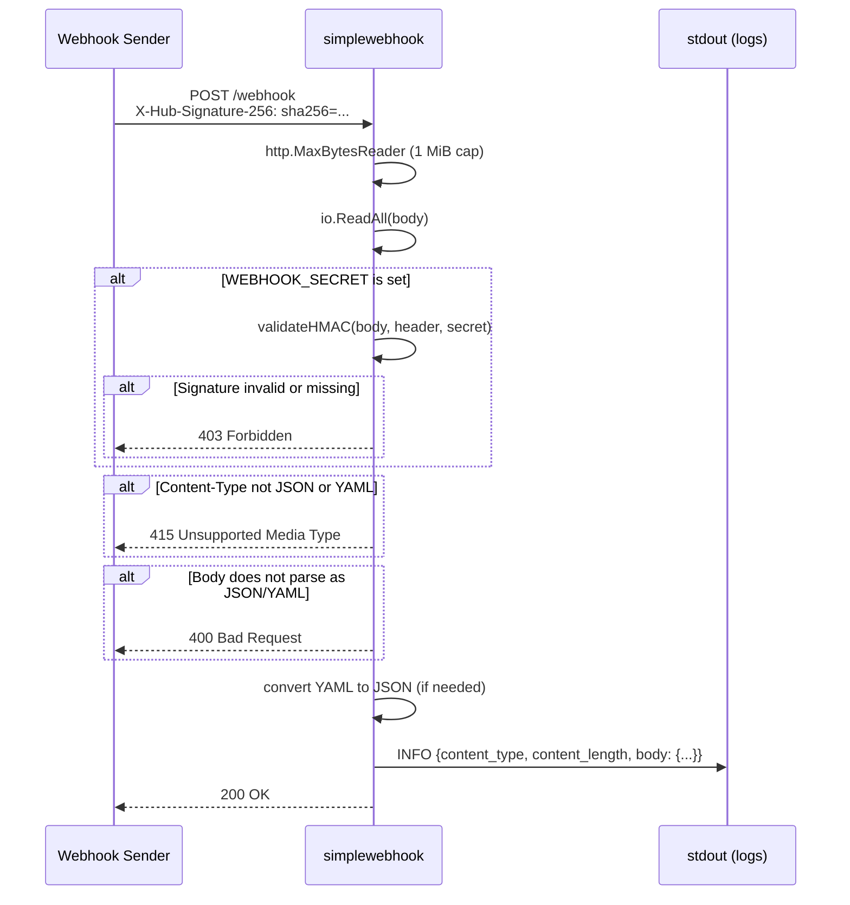
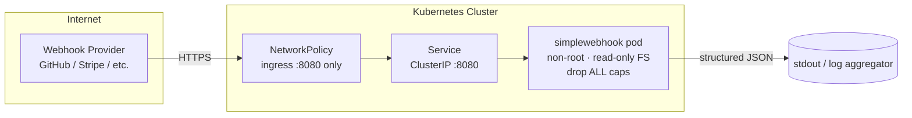

# simplewebhook

[](https://github.com/kengou/simplewebhook/actions/workflows/test.yaml)
[](https://github.com/kengou/simplewebhook/actions/workflows/docker-build.yaml)
[](https://securityscorecards.dev/viewer/?uri=github.com/kengou/simplewebhook)
[](LICENSE)

A lightweight webhook receiver for debugging and testing. It accepts incoming HTTP POST requests (JSON or YAML), validates their signature (optional), and logs the full payload to stdout as structured JSON — making it easy to inspect what any webhook sender is delivering.

## Features

- Logs full webhook payload as structured JSON to stdout
- Accepts JSON and YAML payloads (YAML is converted to JSON before logging)
- Optional HMAC-SHA256 signature verification (GitHub-compatible `X-Hub-Signature-256`)
- Request body size limit (1 MiB) to prevent memory exhaustion
- Graceful shutdown on SIGTERM/SIGINT
- Health check endpoint at `/healthz`
- Single external dependency ([sigs.k8s.io/yaml](https://github.com/kubernetes-sigs/yaml)) — everything else is stdlib
- Multi-arch Docker image (`linux/amd64`, `linux/arm64`)
- Signed container images via [cosign](https://github.com/sigstore/cosign)

## Quick Start

### Run locally

```bash
go run ./main.go
# Server starts on :8080

# Send a test webhook
curl -X POST http://localhost:8080/webhook \
  -H "Content-Type: application/json" \
  -d '{"event":"push","repo":"myrepo"}'

# YAML works too
curl -X POST http://localhost:8080/webhook \
  -H "Content-Type: application/yaml" \
  --data-binary $'event: push\nrepo: myrepo'
```

### Run with Docker

```bash
docker run -p 8080:8080 ghcr.io/kengou/simplewebhook:main
```

### Run in Kubernetes

```bash
kubectl apply -f manifests/
```

## Configuration

All configuration is via environment variables.

| Variable         | Description                                      | Default | Required |
|------------------|--------------------------------------------------|---------|----------|
| `PORT`           | Port to listen on                                | `8080`  | No       |
| `WEBHOOK_SECRET` | Shared secret for HMAC-SHA256 signature validation | —     | No       |
| `LOG_HEADERS`    | Log request headers and connection metadata on `/webhook` (accepts `true`/`1`/`false`/`0`) | `false` | No |

If `WEBHOOK_SECRET` is not set, all requests are accepted without authentication — useful for open debugging sessions.

> [!WARNING]
> `LOG_HEADERS` logs **every** request header verbatim, including secrets such as `Authorization`, `Cookie`, and the `X-Hub-Signature-256` value. Only enable it for trusted/local debugging, and be mindful that anything written to stdout may be retained by your log aggregator.

## API

The full request/response contract lives in [`openapi.yaml`](openapi.yaml) — that file is the single source of truth for the API. In short:

- `POST /webhook` — receives a JSON or YAML payload (max 1 MiB), validates the HMAC signature if `WEBHOOK_SECRET` is set, and logs the body to stdout as structured JSON. YAML payloads are converted to JSON before logging. Requests without a `Content-Type` header are treated as JSON.
- `GET /healthz` — liveness/readiness probe; returns `{"alive": true}`.

**Example log output**

```json
{
  "time": "2026-03-04T10:00:00Z",
  "level": "INFO",
  "msg": "Received webhook request",
  "content_type": "application/json",
  "content_length": 42,
  "body": {"event": "push", "repo": "myrepo"}
}
```

## Authentication

When `WEBHOOK_SECRET` is set, the server validates the `X-Hub-Signature-256` header using hex-encoded HMAC-SHA256. This is the GitHub webhook signature scheme, also used by Gitea and other GitHub-compatible providers.

Providers with their own signature schemes are **not** compatible — e.g. Stripe signs a timestamped payload in `Stripe-Signature`, and Shopify sends a base64-encoded HMAC in `X-Shopify-Hmac-Sha256`. To receive payloads from those providers, leave `WEBHOOK_SECRET` unset (no signature verification).

### Sending a signed request

**curl**

```bash
BODY='{"event":"push","repo":"myrepo"}'
SECRET="mysecret"
SIG="sha256=$(echo -n "$BODY" | openssl dgst -sha256 -hmac "$SECRET" | awk '{print $2}')"

curl -X POST http://localhost:8080/webhook \
  -H "Content-Type: application/json" \
  -H "X-Hub-Signature-256: $SIG" \
  -d "$BODY"
```

**Python**

```python
import hmac, hashlib, requests

body = b'{"event":"push","repo":"myrepo"}'
secret = b"mysecret"
sig = "sha256=" + hmac.new(secret, body, hashlib.sha256).hexdigest()

requests.post("http://localhost:8080/webhook",
    headers={"X-Hub-Signature-256": sig},
    data=body)
```

**Go**

```go
import (
    "crypto/hmac"
    "crypto/sha256"
    "encoding/hex"
    "fmt"
)

func sign(body []byte, secret string) string {
    mac := hmac.New(sha256.New, []byte(secret))
    mac.Write(body)
    return "sha256=" + hex.EncodeToString(mac.Sum(nil))
}
```

### Connecting a real webhook provider

Point any webhook provider to `http://<your-host>:8080/webhook` and set the same secret in both the provider and the `WEBHOOK_SECRET` env var.

For local development, expose the server with [ngrok](https://ngrok.com):

```bash
ngrok http 8080
# Use the https://xxxx.ngrok.io URL as your webhook endpoint
```

## Building

```bash
# Build binary
make build

# Run tests
make test

# Run linter
make lint

# Build Docker image
make docker
```

## Kubernetes Deployment

The `manifests/` directory contains ready-to-use Kubernetes resources:

| File | Description |
|---|---|
| `deployment.yaml` | Deployment with security hardening (non-root, read-only FS, dropped capabilities) |
| `service.yaml` | ClusterIP service on port 8080 |
| `networkpolicy.yaml` | Denies all egress; allows ingress on port 8080 |

To add the webhook secret:

```bash
kubectl create secret generic simplewebhook-secret \
  --from-literal=webhook-secret=mysecret

# Then add to deployment.yaml:
# env:
#   - name: WEBHOOK_SECRET
#     valueFrom:
#       secretKeyRef:
#         name: simplewebhook-secret
#         key: webhook-secret
```

## Architecture

### Request flow



### Deployment topology



## License

Apache 2.0 — see [LICENSE](LICENSE).
